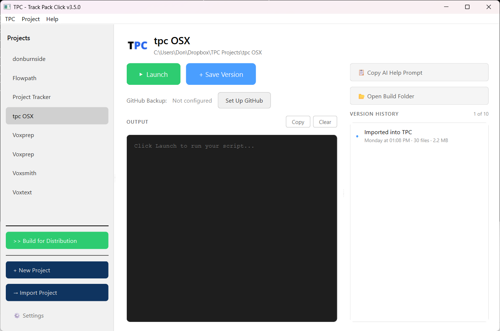

# TPC - Track Pack Click

**The project manager for people who just want to ship.**

TPC is a desktop app that handles version control and Python packaging without the terminal commands, Git incantations, or PyInstaller documentation rabbit holes. Point at your project, click buttons, get results.



## Who Is This For?

- **Solo developers** building tools to solve their own problems
- **Makers** who learned Python to get things done, not to become "developers"
- **Subject matter experts** who write code but don't live in the terminal
- **Anyone** who just wants to hand someone an installer and say "here, this works"

If you've ever lost work because you forgot to commit, spent an afternoon fighting PyInstaller, or avoided sharing your tool because packaging seemed too hard — TPC is for you.

## Features

### Track - Version Control Without Git

- **Save Version** — One click to snapshot your entire project
- **Version History** — Visual timeline of every save, with file counts and sizes
- **Restore** — Go back to any previous version instantly
- **GitHub Backup** — Optional one-way backup to GitHub (not sync, just safety)

No commits. No branches. No merge conflicts. Just snapshots you can see and understand.

### Pack - Build Distributable Apps

- **Dependency Detection** — Automatically scans your imports
- **Virtual Environment** — Creates isolated build environment (you never see it)
- **Icon Conversion** — Drop in a PNG, get proper Windows .ico and Mac .icns
- **One-Click Build** — PyInstaller wrapper that just works

Build a standalone .exe or .app without touching the command line.

## Installation

### Requirements

- Python 3.10 or later
- PyQt6

### Quick Start

```bash
# Clone or download TPC
git clone https://github.com/yourusername/tpc.git
cd tpc

# Install dependencies
pip install PyQt6

# Run TPC
python main.py
```

### First Run

On first launch, TPC will ask where to store your projects. Pick a cloud-synced folder (Dropbox, iCloud, OneDrive) to automatically access your projects from any computer.

## How It Works

### Projects Live in Simple Folders

```
Your Project/
├── main.py
├── your_code.py
├── requirements.txt
└── .tpc/
    ├── project.json      # Project settings
    └── snapshots/        # Version history
        ├── 2025-01-02_1430_Added-feature/
        └── 2025-01-02_0900_Initial-version/
```

No hidden `.git` folders with incomprehensible internals. Your snapshots are just folders you can browse in Finder or Explorer.

### Cloud Sync Just Works

Put your projects in Dropbox/iCloud/OneDrive. TPC doesn't sync anything — your cloud service handles it. Open TPC on your Mac, see your projects. Walk to your Windows machine, same projects, same history.

### GitHub is Backup, Not Sync

TPC treats GitHub as a safety net, not a collaboration tool. Hit "Backup Now" occasionally for offsite peace of mind. No push/pull dance, no diverged histories, no merge conflicts.

## Usage

### Creating a Project

1. Click **+ New Project** in the sidebar
2. Name your project
3. Start coding

### Saving Versions

1. Make changes to your code
2. Click **+ Save Version**
3. Add an optional note ("Added login feature")
4. Done — your snapshot is saved

### Restoring a Previous Version

1. Find the version in the history panel
2. Click **Restore**
3. TPC creates a safety backup, then restores

### Building Your App

1. Click **>> Build for Distribution** in the sidebar
2. Scan dependencies (or load from requirements.txt)
3. Set up your virtual environment
4. Choose an icon (optional)
5. Click **Build**
6. Find your .exe or .app in `TPC Builds/`

## Project Types

TPC supports two project types:

- **Python Projects** — Have a main .py file, can be launched and built
- **Folder Projects** — Any folder you want to track (notes, configs, assets)

## Keyboard Shortcuts

| Action | Shortcut |
|--------|----------|
| Save Version | `Ctrl/Cmd + S` |
| Launch Project | `Ctrl/Cmd + R` |
| Open Build Folder | `Ctrl/Cmd + B` |

## FAQ

**Q: Do I need Git installed?**  
A: No. TPC v3 uses simple folder-based snapshots, not Git.

**Q: Can I use this with existing Git projects?**  
A: Yes. TPC ignores `.git` folders and manages its own snapshots separately.

**Q: Where are my snapshots stored?**  
A: Inside your project folder at `.tpc/snapshots/`. They sync with your cloud service like any other files.

**Q: How many snapshots does TPC keep?**  
A: 10 by default. Oldest snapshots are automatically removed when you exceed the limit. You can change this in project settings.

**Q: Can I build for both Windows and Mac?**  
A: You can build for the platform you're currently on. Cross-platform builds require running TPC on each target platform.

**Q: What Python packages are supported?**  
A: If PyInstaller can bundle it, TPC can build it. Some packages with complex dependencies (like PyQt6, customtkinter) are automatically handled with special flags.

## Troubleshooting

### Build fails with missing module

Add the missing package to your `requirements.txt` and rebuild the virtual environment. TPC's scanner can't detect dynamic imports.

### App launches from TPC but crashes

When launching PyQt/GUI apps from a bundled TPC.app on Mac, there can be Qt library conflicts. Launch your built app directly from Finder or the TPC Builds folder instead.

### "Copy AI Help Prompt" button

Stuck on something? Click this button to copy a detailed prompt with your project state, then paste it into ChatGPT, Claude, or your AI assistant of choice.

## Version History

- **v3.5.0** — Project icon in header, AI help prompts, icon quality improvements
- **v3.0.0** — Complete rewrite: Git replaced with folder-based snapshots
- **v2.x** — Git-based versioning (deprecated)
- **v1.x** — Initial release

## License

MIT License — do whatever you want with it.

## Acknowledgments

Built with:
- [PyQt6](https://www.riverbankcomputing.com/software/pyqt/) — Cross-platform GUI
- [PyInstaller](https://pyinstaller.org/) — Python packaging
- [Pillow](https://pillow.readthedocs.io/) — Icon conversion

---

*"The best version control is the one you don't have to think about."*

**TPC** — Track your work. Pack your app. Click to ship.
